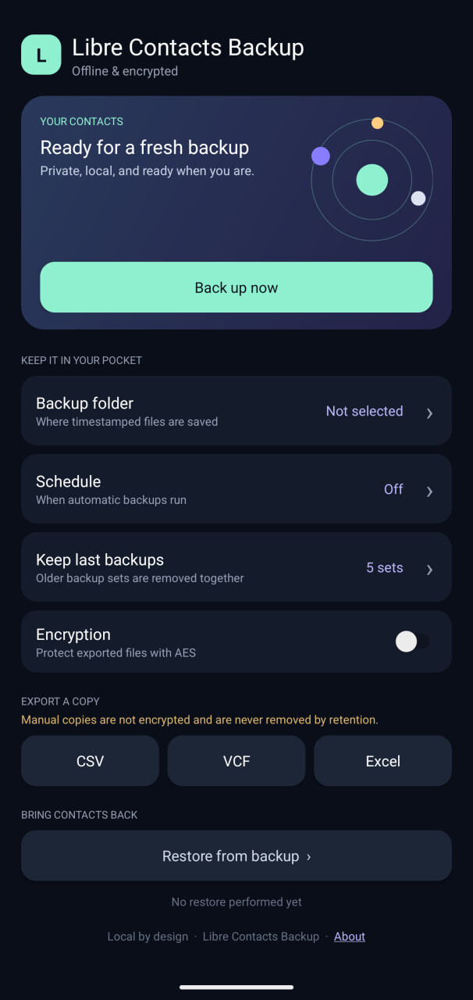

# Libre Contacts Backup

A free, open-source, native Android app that backs up your contacts — fully offline, fully local, fully yours.

- **Libre & open source** — GPL-3.0, no proprietary bits, buildable from source, [available on F-Droid](https://f-droid.org/en/packages/com.ashkanrafiee.librecontactsbackup/).
- **Private by design** — no account, no cloud, no analytics, no network permission at all. Contacts are only read when a backup runs.
- **Local by design** — backups are written to a folder you choose on your own device (or SD card); nothing is ever uploaded anywhere.
- **Scheduled backups** — daily, weekly, or monthly at a time you choose, running automatically in the background, entirely on-device.
- **Retention by age** — keep the newest backups per day, week, and month with counts you choose (e.g. 7 daily + 4 weekly + 3 monthly), so backups of increasing age stay available while old ones thin out; or keep it simple and just keep the last N sets.
- **As close to lossless as the Contacts Provider allows** — preserves the full Contact → RawContact → Data hierarchy (every readable field, every account, every custom type), not a lossy flattened copy.
- **SIM card phonebook included** — every backup also captures the contacts stored on your SIM card; on restore, you choose whether they are written back to the SIM card, into the device address book, or both. On multi-SIM or eSIM phones, each contact goes back to the very card it was captured from — or you can redirect all contacts to one specific card (e.g. a newly acquired SIM).
- **Optional encryption** — AES-256-GCM with a key derived from your password (PBKDF2, 600,000 iterations); the password itself is stored on-device behind an Android Keystore key so scheduled backups can run unattended.

## Download

Libre Contacts Backup can be installed from any of these sources:

- **GitHub** — the fastest way to get the latest updates is installing the signed APK directly from the [GitHub Releases](https://github.com/AshkanRafiee/Libre-Contacts-Backup/releases) page. Pair it with [Obtainium](https://obtainium.imranr.dev/) to receive and install updates automatically.
- **F-Droid** — the preferred store edition for users who like app stores; get it from the [F-Droid listing](https://f-droid.org/en/packages/com.ashkanrafiee.librecontactsbackup/).
- **Myket and Cafe Bazaar** — alternative store editions, handy for users less familiar with the options above:
  - [Cafe Bazaar](https://cafebazaar.ir/app/com.ashkanrafiee.librecontactsbackup)
  - [Myket](https://myket.ir/app/com.ashkanrafiee.librecontactsbackup)

## Backup format

Each backup is a single timestamped `.lcb` archive containing:

| File | Purpose |
|------|---------|
| `android-contacts.json` | Canonical lossless snapshot — what restore reads from |
| `contacts.vcf` | Standard vCard, for use with other apps |
| `contacts.json` / `contacts.csv` | Human-readable exports |
| `manifest.json` | Checksums and format version |

On restore, contacts that originally belonged together (e.g. synced from Google *and* stored locally) are recreated as separate raw contacts, each keeping its own original source, and linked back together as one contact — without ever merging two different people who just happen to share a name.

Libre Contacts Backup preserves contact information, including less-common and provider-specific data that may be missed by ordinary vCard backups. During restore, you choose which available categories to include — contact information, photos, groups, additional/provider-specific data, and account information can each be restored or skipped independently. A few things to know:

- Contact IDs and RawContact IDs may change on restore; the app does not try to recreate Android's internal provider bookkeeping.
- Provider/account metadata may not be restorable on every device, and preserving it doesn't guarantee the original app (e.g. a messaging app) will recognize the contact as its own.
- Anything a selected category can't restore is reported, not silently dropped.
- Anything you don't select stays fully intact inside the `.lcb` — the archive is never modified by what you restore, and it can be restored again later with a different selection.

## Build

```bash
./gradlew assembleDebug     # unsigned debug build
./gradlew assembleRelease   # unsigned release build
```

To produce a signed release, add your own keystore details in a `signing.properties` file (see [`docs/RELEASING.md`](docs/RELEASING.md)). It's gitignored and never belongs in the repo.

## Test

```bash
./gradlew connectedDebugAndroidTest   # instrumented tests, needs a device/emulator
```

## License

GPL-3.0. Source: https://github.com/AshkanRafiee/Libre-Contacts-Backup

## Screenshot


